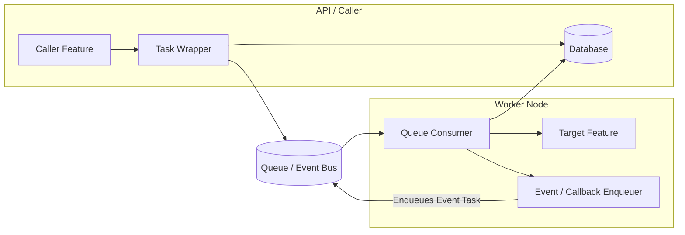
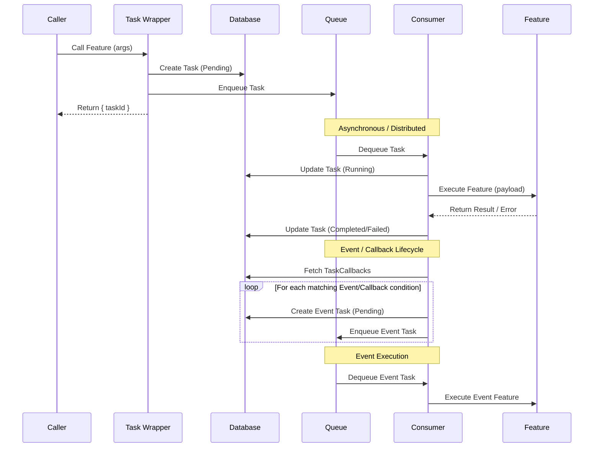

# Distributed Tasks and Workflows - The Node In Layers Package for Creating / Running Asynchronous Tasks and Workflows

This repository provides a standardized interface, models, and functional code for running distributed tasks within the Node in Layers framework. It handles complex workflows with hierarchical task spawning, future scheduling, and event-driven callbacks. 

Tasks are executed at the "feature" level, ensuring all business logic remains decoupled from the distributed queueing infrastructure.

## Architecture

The `@node-in-layers/tasks` package decouples the *request* to run a feature from its *execution*. This allows features to be executed asynchronously, distributed across multiple workers, and retried automatically.

### The Execution Flow

1. **Invocation**: A caller invokes a wrapped feature (e.g., `myFeature(args)`).
2. **Task Creation**: The wrapper intercepts the call, creates a `Task` record in the database (status: `Pending`), and saves the arguments as the task's `payload`.
3. **Enqueueing**: The wrapper enqueues the Task onto the distributed Queue (e.g., BullMQ) and synchronously returns the `{ taskId }` to the caller.
4. **Consumption**: A separate long-running Consumer process (typically a CLI application) polls the Queue and dequeues the Task.
5. **Execution**: The Consumer updates the Task status to `Running`, looks up the registered feature, and executes it with the original payload.
6. **Completion**: Once the feature finishes, the Consumer updates the Task status to `Completed` (or `Failed`) and saves the result.
7. **Event Callbacks**: The Consumer triggers the callback lifecycle. It queries the database for any `TaskCallbacks` linked to the task. For each matching callback (based on success/failure conditions), it *enqueues a new Task* for the callback feature. These callbacks act as an event-driven infrastructure.

## Implementations

While the system can be customized to use any implementation, the out-of-the-box implementation uses **BullMQ** for queueing and **Docker** or **Local** for task runners.

### The Consumer Domain

To actually process tasks, the implementing system must create a long-running consumer. This is typically a separate domain (e.g., `@events` or `@workers`) with a feature that polls the queue and calls `tasks.features.registerTaskConsumer()`. A CLI application then executes this consumer feature to keep the worker alive.

## Features & Capabilities

- **Smart Wrappers**: Wrap any `annotatedFunction` to automatically make it a distributed task.
- **Synchronous Bypass**: Callers can pass `{ tasks: { executeSync: true } }` to bypass the queue and run the feature immediately in the current process.
- **Event-Driven Callbacks**: Register callbacks that fire `onSuccess`, `onFailure`, or `onAnyCompletion`. Callbacks are enqueued as their own distributed tasks.
- **Retries & Backoff**: Configure automatic retries for flaky tasks.
- **Hierarchical Tasks**: Tasks can spawn sub-tasks, and parent tasks are automatically evaluated when all children complete.
